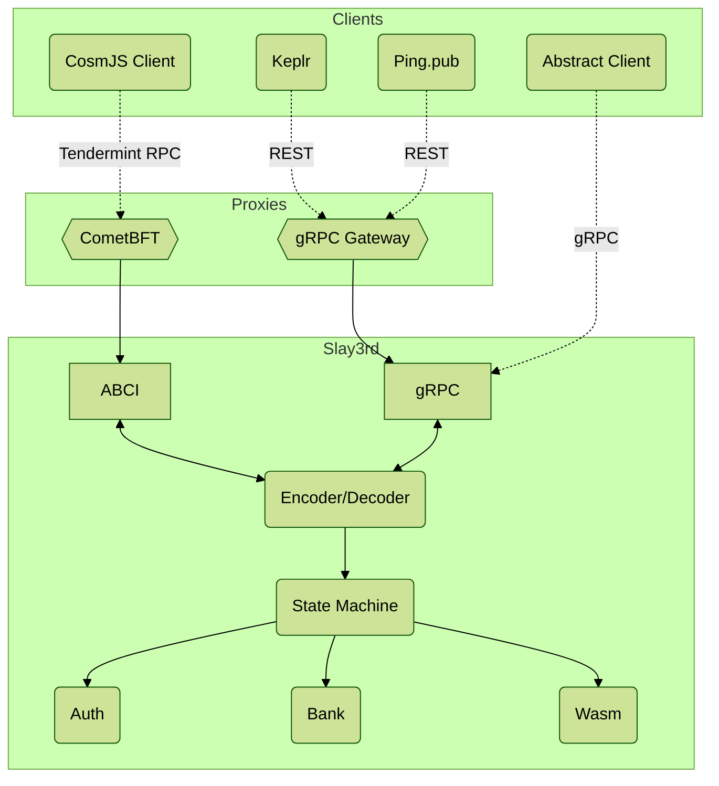

# Lay3r Architecture

Lay3r is a high-performance, pure Rust blockchain built around CosmWasm smart contracts.
It will add other VMs (notably EVM) in the future, but the system infrastructure
(namely staking and governance) will remain in privileged COsmWasm contracts.

It has it's own internal query and message system, which are not meant to be serialized,
but designed for efficient and safe in-memory execution. It then has an adapter layer
to parse various transaction and query formats into the native representation, 
and the responses back, in order to emulate compatibility with existing systems.

## Designed for Compatibility

As of May 2024, we have currently implemented compatibility with Cosmos SDK APIs
to a large degree, based on testing with major client projects. This includes
Tendermint RPC format (CosmJS compatibility), gRPC, and the LCD/REST endpoints,
as well as the transaction format and legacy signing mode. Note that not all features
of the Cosmos SDK are supported, which is a deliberate design decision to keep
our system streamlined. Rather, all features of the Cosmos SDK that we support will also
be accessible via the standard Cosmos SDK types and APIs.

This push for both compatibility and to avoid any tight coupling to the Cosmos SDK
will allow us much more flexibility to enter other blockchain ecosystems. As a clear
next step, we want to work as an Ethereum L2 and have tight compatibility with Ethereum
tooling. Part of this is future plans for integrating the EVM, but more than that, we need
to ensure that Ethereum transaction formats work with our system, Ethereum RPC endpoints
are provided with proper functionality, etc. We will want Metamask, Hardhat, Truffle, etc
to all "just work" with our system, with no more difficulty than pointing to a new Ethereum L2.

CometBFT (Tendermint) types are also not tightly coupled to our system, with the
desire that we could use this codebase to support a chain on another consensus algorithm
(like HotStuff) without too much trouble. It would require integration work with the new algorithm,
which would find place in the `/app` directory, but all the standard packages in `packages/*`
should not require modification. At least, this is the design goal, while it is hard to prove
in absence of a clear plan of a new consensus engine.

## System Overview

**TODO**

## Code Overview

Applications (under `app/` directory):

* [`slay3rd`](./app/slay3rd) - this is the binary executable for an ABCI++ application that connects with CometBFT to form a blockchain node.

Packages (under `packages/` directory):

* [`abci`](./packages/abci) - App-generic code to run a high-performance ABCI server (to connect to CometBFT). This was based on [Tendermint ABCI](https://github.com/informalsystems/tendermint-rs/tree/main/abci), but with changes made to increase performance and concurrency. 
* [`app`](./packages/app) - This is the main business logic of the blockchain. It handles the calls from the `abci` server to process transactions and queries. It has a few core modules built-in:
    * [`auth`](./packages/app/src/auth)
    * [`bank`](./packages/app/src/bank)
    * [`wasm`](./packages/app/src/wasm)
* ^^[`cosmos`](./packages/cosmos) - Code to translate custom cosmos types and transactions to our internal format. Makes heavy use of the [`proto`](./packages/proto) package to provide the Cosmos types.
* ^^[`proto`](./packages/proto) - [Prost](https://crates.io/crates/prost) codegen of the Cosmos SDK types. Unfortunately, we could not use the types from [`cosmos-rust`](https://github.com/cosmos/cosmos-rust) as those don't support the types for our gRPC server (they were designed for clients)
* [`std`](./packages/std) - All the standard types we use throughout our system. This should import no other crate of ours and be imported by almost all the others.
* [`storage`](./packages/storage) - This is a port of the types from [`cw-storage-plus`](https://github.com/CosmWasm/cw-storage-plus) to work with our storage interfaces (which include gas metering). It allows use of type-safe `Item` and `Map` throughout the native modules in the [`app`](./packages/app) package.

Other APIs:

* ^^[`gateway`](./gateway) - This is [`grpc-gateway`](https://github.com/grpc-ecosystem/grpc-gateway) codegen API to provide a reverse proxy of HTTP/JSON types to the internal gRPC server. This performs the functionality of the "LCD" server in the Cosmos SDK.
* ^^[`proto`](./proto) (top-level, not `packages/proto`) - standard Cosmos protobuf types that we use for compatibility. These were copied from the upstream repos, but all the custom gogoproto and sdkproto directives removed to make them standard `.proto` files we can use in Rust.

Testing:

* [`contracts`](./contracts) - Provides a couple CosmWasm contracts, which we use in integration testing to ensure we properly implement the CosmWasm APIs. They are not meant for any useful purpose, just for internal testing. The contracts for the chain launch (staking, governance, etc) will be in a separate repo.
* [`artifacts`](./artifacts) - Contains pre-built `*.wasm` files from the above contracts, created by `scripts/build_contracts.sh`
* [`fixtures`](./packages/app/fixtures) - Contains our custom contracts, as well as some standard ones from the CosmWasm ecosystem, which we use in testing our blockchain implementation, specifically [the wasm module](./packages/app/src/wasm).
* [`integration`](./integration) - CosmJS based integration tests that provide full-stack test of our compatibility with the Cosmos ecosystem tooling. This is essential to ensure our transaction signature verification is compatible, and covers any Tendermint RPC queries.

Tooling:

* [`docker`](./docker) - Docker files to containerize the various applications in our stack. These are used by [`docker-compose.yml`](./docker-compose.yml) to launch a local network for testing
* [`scripts`](./scripts) - Various bash scripts to build various parts of the system, and others needed to run a local network for testing
* [`tools`](./tools) - Rust code that doesn't belong in our packages, but rather part of our build system. Currently only [`proto-compiler`](./tools/proto-compiler), which uses Prost to build `packages/proto` from the definitions in `proto` 
* [CometBFT](https://github.com/cometbft/cometbft) - External: the consensus engine we use to drive the `slayerd` process. Imported as a docker image from external repo.
* [Jaeger](https://www.jaegertracing.io) - External: the tracing system to display default metrics on all API calls on a node. Imported as a docker image from external repo.

## TODO

* Reorganize packages to make it clear which are cosmos compatibility and which are "core". I marked cosmos packages with `^^`